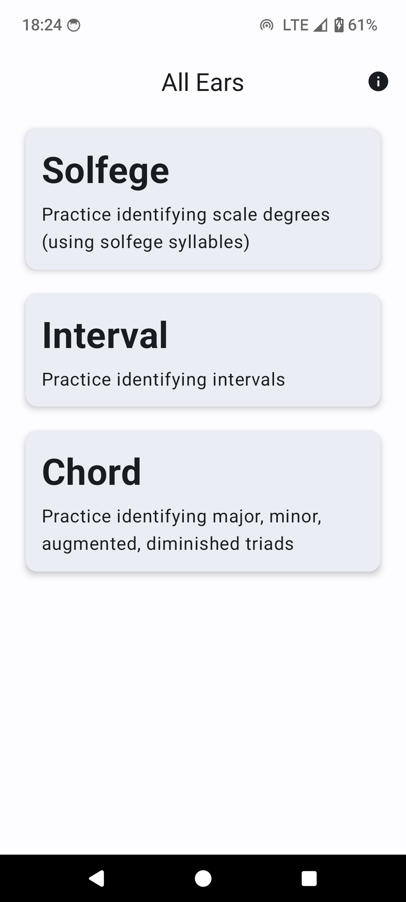
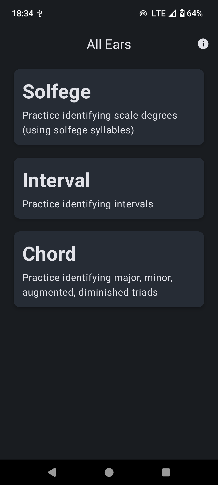
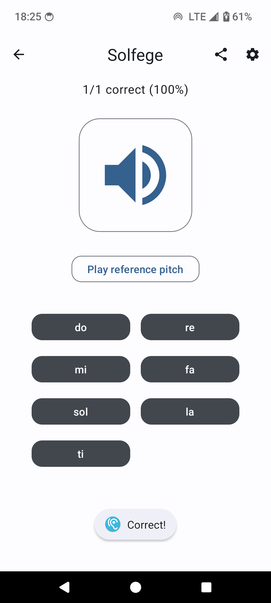
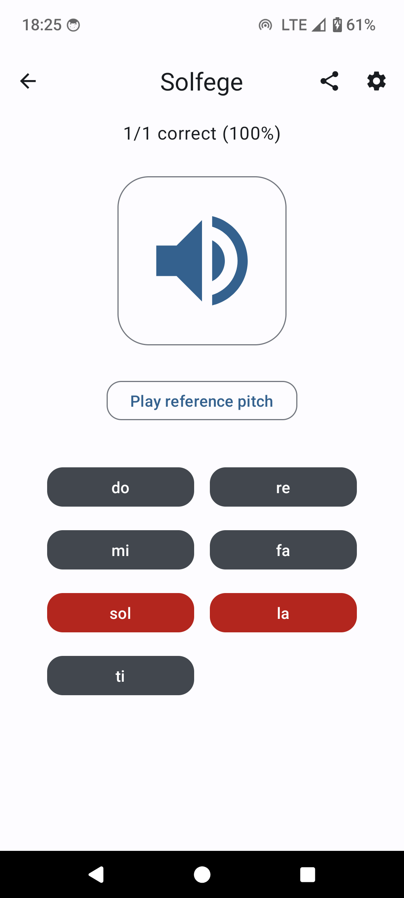
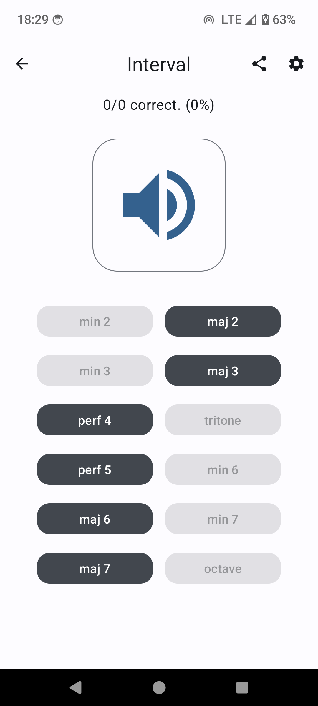
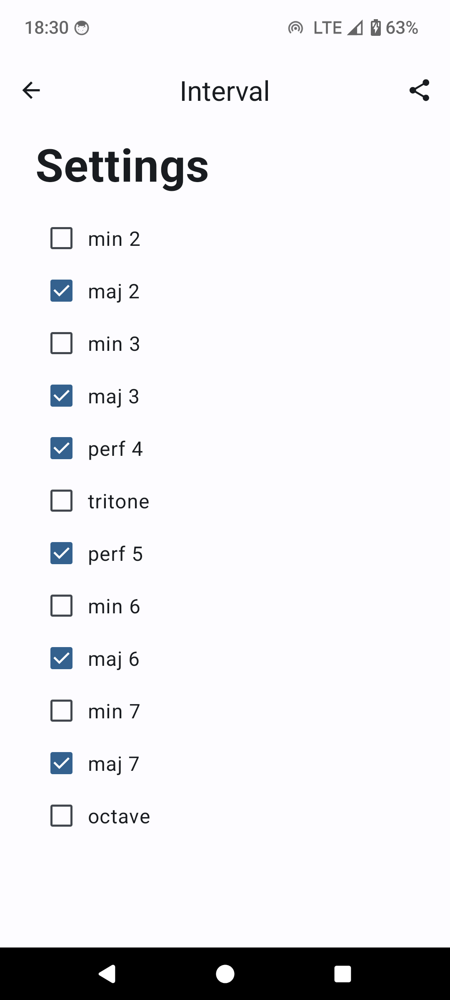
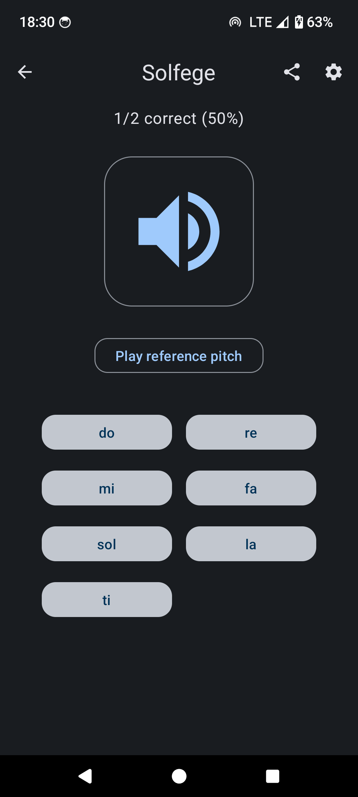
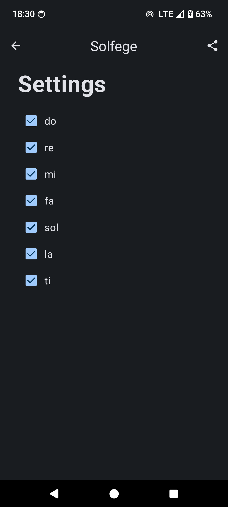

# All-Ears

Android ear-training app built with Jetpack Compose and Material 3

### About the app

This app is adapted from my semester project for COMP 402 (Principles of Android Programming). It is written in Kotlin and uses Jetpack Compose and Material Design 3. The app presents 3 interactive quiz modes where users must identify what they hear. To customize the quizzes, users can select which notes, intervals, and chords they wish to be quizzed on.

I've removed some features from the project submission as they were only added to meet the rubric and are unnecessary to the app's proper functioning. To see that project and to see who wrote what, look [here](https://github.com/TitanChariotsBB/All-Ears-COMP402).

### Screenshots

 

 

 

 